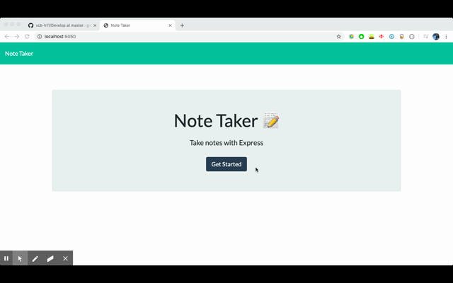

# Note Taking App

## How It works

- The user can create, store, review, and delete notes from a local server.

- As long as the server is running, the notes will be saved indefinitely.

## How to run

- Fork this repo, open the folder and type 'npm start' into your terminal.

- You can now open this app at http://localhost:5050.

-  You can now write, view, and delete notes when you are done with them.

## Technologies used

- Node.js

- Express.js

## Screenshot
